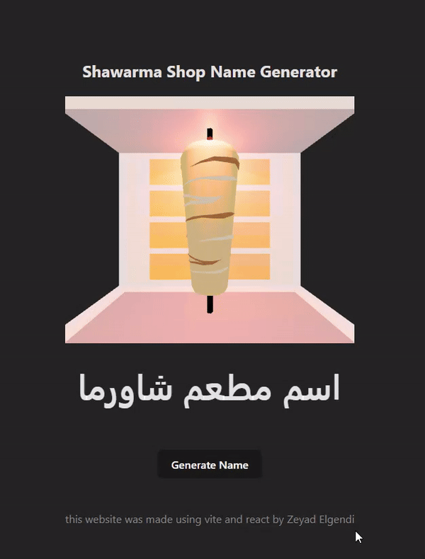

# Shawarma Shop Name Generator 🌯

Welcome to the Restaurant Name Generator project! This web application generates Arabic names for Shawarma restaurant.

## Table of Contents
- [About](#about)
- [Demo](#demo)
- [Features](#features)
- [Technologies Used](#technologies-used)

- [License](#license)

## About
The Restaurant Name Generator is a fun and interactive web application built using React and React Three Fiber. It provides users with a simple yet engaging way to generate restaurant names at random. Whether you're brainstorming ideas for a new eatery or just looking for inspiration, this app has you covered!

## Demo

## Features
- **Random Name Generation**: Get unique Shawarma restaurant names with just a click of a button.
- **Built with React**: Leverage the power of React for efficient and dynamic web development.
- **Powered by React Three Fiber**: Experience stunning 3D visuals and animations thanks to React Three Fiber integration.

## Technologies Used
- React: A popular JavaScript library for building user interfaces.
- React Three Fiber: A React renderer for Three.js, enabling 3D graphics in React applications.
- HTML/CSS: Standard web technologies for structure and styling.
- JavaScript: The programming language used for client-side scripting.

## License
This project is licensed under the [MIT License](LICENSE).
